# ZenSys: Distributed Job Scheduling Platform (DJSP)

[](https://openjdk.org/projects/jdk/25/)
[](https://spring.io/projects/spring-boot)
[](https://spring.io/projects/spring-cloud)
[](https://kafka.apache.org/)
[](https://supabase.com/)
[](https://upstash.com/)

**ZenSys** is a high-throughput, fault-tolerant, horizontally scalable Distributed Job Scheduling Platform designed to coordinate, dispatch, execute, and monitor asynchronous and scheduled workloads across distributed environments.

The platform natively supports three job scheduling paradigms:
* **One-Time Jobs (`ONCE`)**: Executed immediately or at an explicit future timestamp.
* **Cron-Based Recurring Jobs (`CRON`)**: Executed recurrently according to standard unix/quartz 6-field cron expressions with timezone awareness.
* **Interval-Based Recurring Jobs (`INTERVAL`)**: Executed recurrently at fixed-second intervals relative to completion or scheduling timestamps.


## Key Features

- Distributed job scheduling
- One-time, cron and interval scheduling
- Event-driven architecture with Apache Kafka
- CQRS-based read/write separation
- PostgreSQL-backed scheduling
- Redis distributed locks and delay queues
- Java 25 Virtual Threads
- Automatic executor failure detection
- Exponential retry with delayed delivery
- Multi-layer idempotency
- Horizontal worker scalability
- REST APIs through Spring Cloud Gateway
- Eureka service discovery
---

## Table of Contents
1. [Core Architectural Highlights](#1-core-architectural-highlights)
2. [System Architecture Diagram](#2-system-architecture-diagram)
3. [Microservices Repository Layout](#3-microservices-repository-layout)
4. [Prerequisites & Infrastructure](#4-prerequisites--infrastructure)
5. [Step-by-Step Local Setup & Startup Order](#5-step-by-step-local-setup--startup-order)
6. [API Quickstart & cURL Guide](#6-api-quickstart--curl-guide)
7. [In-Depth System Design & Technical Mechanics](#7-in-depth-system-design--technical-mechanics)
   * [7.1 CQRS Architectural Pattern](#71-cqrs-architectural-pattern)
   * [7.2 Distributed Polling & Lease Protocol (SKIP LOCKED)](#72-distributed-polling--lease-protocol-skip-locked)
   * [7.3 Project Loom & Java 25 Virtual Threads Worker Pool](#73-project-loom--java-25-virtual-threads-worker-pool)
   * [7.4 Dead Man's Switch & Zombie Sweeper Recovery](#74-dead-mans-switch--zombie-sweeper-recovery)
   * [7.5 Distributed Delay Queue via Redis Sorted Sets & Lua](#75-distributed-delay-queue-via-redis-sorted-sets--lua)
   * [7.6 Multi-Layer Idempotency & State Machine Guard](#76-multi-layer-idempotency--state-machine-guard)
8. [Kafka Event Matrix & Schemas](#8-kafka-event-matrix--schemas)
9. [Database & Redis Data Models](#9-database--redis-data-models)

---

## 1. Core Architectural Highlights

* **Command Query Responsibility Segregation (CQRS)**:
  * **Write Path**: `job-service` handles job creation, updates, and cancellations as a pure stateless gateway, producing events directly to Kafka with **zero database connections**.
  * **Read Path**: `job-search-service` provides optimized, read-only queries directly against PostgreSQL (`ddl-auto=validate`) leveraging compound indexes.
  * **State Synchronization**: `consumer-service` consumes Kafka events and acts as the sole authority mutating the relational database.
* **Database Polling & Non-Blocking Leases**: `watcher-service` claims due jobs in PostgreSQL using `@Lock(LockModeType.PESSIMISTIC_WRITE)` with hint timeout `-2` (`SELECT ... FOR UPDATE SKIP LOCKED`) in ultra-short (~10ms) transactions.
* **Java 25 Virtual Threads**: `executor-service` executes worker tasks on lightweight Virtual Threads (`Executors.newVirtualThreadPerTaskExecutor()`) with hard timeout enforcement (`CompletableFuture.orTimeout()`).
* **Dead Man's Switch**: `executor-service` pulses heartbeats every 10 seconds into Redis (`TTL = 30s`). If an executor crashes abruptly mid-job, `watcher-service` detects the missing heartbeat, acquires a distributed recovery lock, and automatically recovers the orphan run.
* **Atomic Redis Delay Queue**: `retry-service` buffers failed runs into Redis Sorted Sets scored by due timestamp using atomic Lua scripts, leasing due items and re-dispatching them to Kafka with at-least-once delivery semantics.

---

## 2. System Architecture Diagram

```mermaid
flowchart TB
    %% Ingress & Discovery
    subgraph IngressLayer ["Ingress & Discovery Layer"]
        Client["Web / API Clients<br/><i>(localhost:5173, localhost:3000)</i>"]
        Gateway["api-gateway<br/><b>Port: 8080</b><br/><i>Spring Cloud Gateway MVC</i>"]
        Eureka["service-registry<br/><b>Port: 8761</b><br/><i>Eureka Server</i>"]
    end

    %% CQRS Layer
    subgraph CQRSLayer ["API Layer (CQRS Separation)"]
        JobService["job-service<br/><b>Port: 8081</b><br/><i>Write / Ingestion</i>"]
        SearchService["job-search-service<br/><b>Port: 8083</b><br/><i>Read / Query</i>"]
    end

    %% Kafka Broker
    subgraph KafkaBroker ["Apache Kafka Broker (localhost:9092)"]
        TopicCommands["Topic: <b>job-commands</b><br/>Key: <code>jobId</code>"]
        TopicRun["Topic: <b>run</b><br/>Key: <code>jobId</code>"]
        TopicRunEvents["Topic: <b>job-run-events</b><br/>Key: <code>runId</code>"]
        TopicRetry["Topic: <b>retry</b><br/>Key: <code>jobId</code>"]
        TopicDead["Topic: <b>dead</b><br/>Key: <code>jobId</code>"]
    end

    %% Execution & Worker Layer
    subgraph ExecutionLayer ["Worker & Dispatch Layer"]
        JobConsumer["job-consumer-service<br/><b>Port: 8085</b><br/><i>Dispatcher (OpenFeign Client)</i>"]
        ExecutorService["executor-service<br/><b>Port: 8086</b><br/><i>Virtual Threads Worker Pool</i>"]
        TaskRunner["TaskRunner<br/><i>Webhooks & Tasks</i>"]
    end

    %% Scheduling & Delay Queue
    subgraph EngineLayer ["Scheduling & Delay Engines"]
        WatcherService["watcher-service<br/><b>Port: 8084</b><br/><i>SKIP LOCKED Poller & Zombie Sweeper</i>"]
        RetryService["retry-service<br/><b>Port: 8087</b><br/><i>Redis ZSET Delay Sweeper</i>"]
    end

    %% Persistence Layer
    subgraph PersistenceLayer ["Persistence & State Layer"]
        ConsumerService["consumer-service<br/><b>Port: 8082</b><br/><i>State Machine & 2-Layer Idempotency</i>"]
    end

    %% Data Stores
    subgraph StorageLayer ["Data Stores"]
        PostgresDB[("PostgreSQL Database<br/><i>jobs, job_runs, idempotency</i>")]
        RedisStore[("Redis Cloud Store<br/><i>Heartbeats, ZSET Delay Queue, Locks</i>")]
    end

    %% Data Flow Connections
    Client -->|"HTTP Requests"| Gateway
    Gateway -.->|"Discover Routes"| Eureka
    Gateway -->|"Write: POST, PUT, DELETE"| JobService
    Gateway -->|"Read: GET /jobs/**"| SearchService

    JobService -->|"Publish JobCommand"| TopicCommands
    TopicCommands -->|"Consume Commands"| ConsumerService
    ConsumerService -->|"Save / Update"| PostgresDB
    SearchService -->|"Read Queries (validate)"| PostgresDB

    WatcherService -->|"Pessimistic Lock (SKIP LOCKED)"| PostgresDB
    WatcherService -->|"Publish Due JobRunEvent"| TopicRun
    WatcherService -->|"Check Heartbeat / Trip Switch"| RedisStore

    TopicRun -->|"Consume Run"| JobConsumer
    JobConsumer -->|"Emit PENDING"| TopicRunEvents
    JobConsumer -->|"OpenFeign HTTP POST /executor/run"| ExecutorService

    ExecutorService -->|"Virtual Threads Task Execution"| TaskRunner
    ExecutorService -->|"Pulse Heartbeat (TTL 30s)"| RedisStore
    ExecutorService -->|"Emit RUNNING / SUCCESS / TIMEOUT / FAILED"| TopicRunEvents
    ExecutorService -->|"Emit Retry (Exponential Backoff)"| TopicRetry
    ExecutorService -->|"Emit Dead Letter"| TopicDead

    TopicRetry -->|"Consume Retry Event"| RetryService
    RetryService -->|"Atomic Lua: ZADD delayed"| RedisStore
    RetryService -->|"Atomic Lua: Lease & Re-dispatch"| TopicRun

    TopicRunEvents -->|"Sync Lifecycle Status"| ConsumerService
    TopicDead -->|"Sync Dead Letter Status"| ConsumerService

    classDef edge fill:#1e293b,stroke:#38bdf8,stroke-width:2px,color:#f8fafc;
    classDef service fill:#0f172a,stroke:#818cf8,stroke-width:2px,color:#f8fafc;
    classDef kafka fill:#1e1b4b,stroke:#a855f7,stroke-width:2px,color:#f8fafc;
    classDef storage fill:#14532d,stroke:#4ade80,stroke-width:2px,color:#f8fafc;

    class Gateway,Client edge;
    class Eureka,JobService,SearchService,JobConsumer,ExecutorService,ConsumerService,WatcherService,RetryService service;
    class TopicCommands,TopicRun,TopicRunEvents,TopicRetry,TopicDead kafka;
    class PostgresDB,RedisStore storage;
```



---

## 3. Microservices Repository Layout

```
ZenSys - DJSP/Backend/
├── api-gateway/            # Port 8080 - Spring Cloud Gateway MVC, routing, CORS & Actuator
├── service-registry/       # Port 8761 - Spring Cloud Netflix Eureka Discovery Server
├── job-service/            # Port 8081 - CQRS Write side, command validation & Kafka producer
├── job-search-service/     # Port 8083 - CQRS Read side, search & run history queries
├── consumer-service/       # Port 8082 - Core database persistence, idempotency & state machine
├── watcher-service/        # Port 8084 - SKIP LOCKED database poller & Dead Man's Switch sweeper
├── job-consumer-service/   # Port 8085 - Run message consumer, lifecycle initializer & Feign dispatcher
├── executor-service/       # Port 8086 - Java 25 Virtual Threads task runner & Redis heartbeats
└── retry-service/          # Port 8087 - Redis Sorted Set delay queue & atomic Lua retry sweeper
```

---

## 4. Prerequisites & Infrastructure

Before running the platform, ensure you have the following installed and running:

1. **Java Development Kit (JDK 25)**:
   ```bash
   java -version
   # Expected: openjdk 25 or oracle jdk 25
   ```
2. **Apache Maven (v3.9+)**:
   ```bash
   mvn -version
   ```
3. **Apache Kafka (Running on `localhost:9092`)**:
   ```bash
   # If running via Docker:
   docker run -d --name zensys-kafka -p 9092:9092 -e KAFKA_ENABLE_KRAFT=yes apache/kafka:latest
   ```
4. **PostgreSQL (Supabase Cloud or Local on `localhost:5432`)**:
   * Pre-configured in `application.properties` to Supabase PostgreSQL.
5. **Redis (Upstash Cloud or Local on `localhost:6379`)**:
   * Pre-configured in `application.properties` to Upstash Redis with TLS (`rediss://`).

---

## 5. Step-by-Step Local Setup & Startup Order

Because ZenSys microservices discover each other via Eureka and coordinate over Kafka, services should be booted in the following designated sequence:

```
[1. Service Registry (8761)]
          │
          ▼
[2. Persistence & Engines] ──► consumer-service (8082)
          │                ──► watcher-service (8084)
          │                ──► retry-service (8087)
          ▼
[3. Workers & Dispatchers] ──► executor-service (8086)
          │                ──► job-consumer-service (8085)
          ▼
[4. Ingestion & Read APIs] ──► job-service (8081)
          │                ──► job-search-service (8083)
          ▼
[5. API Gateway (8080)]    ──► api-gateway (8080)
```

### Starting the Services (Terminal / PowerShell)

Navigate into each service folder and execute:

```powershell
# 1. Service Registry (Port 8761) - Start FIRST
cd service-registry
./mvnw spring-boot:run

# 2. State & Engine Services (Open separate terminals)
cd consumer-service; ./mvnw spring-boot:run     # Port 8082
cd watcher-service; ./mvnw spring-boot:run      # Port 8084
cd retry-service; ./mvnw spring-boot:run        # Port 8087

# 3. Execution & Dispatch Services
cd executor-service; ./mvnw spring-boot:run     # Port 8086
cd job-consumer-service; ./mvnw spring-boot:run # Port 8085

# 4. Ingestion & Query Services
cd job-service; ./mvnw spring-boot:run          # Port 8081
cd job-search-service; ./mvnw spring-boot:run   # Port 8083

# 5. API Gateway (Port 8080) - Start LAST
cd api-gateway; ./mvnw spring-boot:run          # Port 8080
```

Verify Eureka dashboard: Open [http://localhost:8761](http://localhost:8761) to confirm all microservices are registered.

---

## 6. API Quickstart & cURL Guide

All external API interactions route through the **API Gateway** on port `8080`.

### 1. Create a One-Time Webhook Job (`ONCE`)
Dispatches an external HTTP request at a specific instant or immediately:
```bash
curl -X POST http://localhost:8080/jobs/create \
  -H "Content-Type: application/json" \
  -d '{
    "name": "send-welcome-webhook",
    "scheduleType": "ONCE",
    "scheduleTime": "2026-09-25T12:00:00Z",
    "retries": 3,
    "payload": "{\"url\": \"https://httpbin.org/post\", \"method\": \"POST\", \"body\": {\"event\": \"user_registered\"}, \"timeoutSeconds\": 15}"
  }'
```

### 2. Create a Recurring Cron Job (`CRON`)
Runs every 5 minutes in a specified timezone:
```bash
curl -X POST http://localhost:8080/jobs/create \
  -H "Content-Type: application/json" \
  -d '{
    "name": "sync-inventory-cron",
    "scheduleType": "CRON",
    "cronExpression": "*/5 * * * *",
    "retries": 3,
    "meta": "{\"timezone\": \"Asia/Kolkata\"}",
    "payload": "{\"url\": \"https://httpbin.org/post\", \"method\": \"POST\", \"body\": {\"action\": \"sync_inventory\"}}"
  }'
```

### 3. Create an Interval-Based Benchmark Job (`INTERVAL`)
Runs continuously every 30 seconds with simulated execution:
```bash
curl -X POST http://localhost:8080/jobs/create \
  -H "Content-Type: application/json" \
  -d '{
    "name": "benchmark-simulated-task",
    "scheduleType": "INTERVAL",
    "retries": 4,
    "meta": "{\"intervalSeconds\": 30}",
    "payload": "{\"durationMs\": 2500, \"fail\": false}"
  }'
```

### 4. Update an Existing Job
```bash
curl -X PUT http://localhost:8080/jobs/update/01JCXYZ1234567890ABCDEF \
  -H "Content-Type: application/json" \
  -d '{
    "name": "updated-inventory-cron",
    "scheduleType": "CRON",
    "status": "SCHEDULED",
    "cronExpression": "0 */10 * * * *",
    "retries": 5,
    "payload": "{\"url\": \"https://httpbin.org/post\", \"method\": \"POST\"}"
  }'
```

### 5. Delete a Job
```bash
curl -X DELETE http://localhost:8080/jobs/delete/01JCXYZ1234567890ABCDEF
```

### 6. Query Job & Execution Runs (Read Path)
```bash
# Get job by ID
curl http://localhost:8080/jobs/01JCXYZ1234567890ABCDEF

# List all scheduled jobs
curl "http://localhost:8080/jobs?status=SCHEDULED&scheduleType=CRON"

# Inspect execution run history for a job (ordered descending by start time)
curl http://localhost:8080/jobs/01JCXYZ1234567890ABCDEF/runs

# Inspect a specific run by ULID
curl http://localhost:8080/jobs/runs/01JCXYZ99999999999ABCDEF

# List all runs that experienced timeouts
curl "http://localhost:8080/jobs/runs?status=TIMEOUT"
```

---

## 7. In-Depth System Design & Technical Mechanics

### 7.1 CQRS Architectural Pattern
```
[Client]
   │
   ├──► POST,PUT,DELETE ──► job-service (8081) ──► Kafka 'job-commands' ──► consumer-service (8082) ──► PostgreSQL (Write)
   │
   └──► GET /jobs/**    ──► job-search-service (8083) ───────────────────────────────────────────────► PostgreSQL (Read-Only)
```
* **Stateless Write Gateways**: `job-service` never opens a database connection. It validates payloads, calculates next execution schedules, generates monotonic ULIDs, and publishes to Kafka partitioned by `jobId`.
* **Isolated Query Engine**: `job-search-service` connects using `spring.jpa.hibernate.ddl-auto=validate`, guaranteeing zero DDL modification risk and unconstrained read scaling.

---

### 7.2 Distributed Polling & Lease Protocol (SKIP LOCKED)
To avoid standard database lock contention and race conditions when multiple scheduler nodes run concurrently:
1. `watcher-service` executes `@Scheduled(fixedDelay = 20s)` with Spring Data JPA query:
   ```sql
   SELECT j FROM Job j
   WHERE j.status IN ('SCHEDULED', 'RUNNING')
     AND j.nextRunTime <= :now
     AND (j.lastPolledTime IS NULL OR j.lastPolledTime < :threshold)
   ORDER BY j.nextRunTime ASC
   ```
2. The query is executed with `@Lock(LockModeType.PESSIMISTIC_WRITE)` and hint timeout `-2` (`FOR UPDATE SKIP LOCKED`).
3. Due jobs are leased by setting `lastPolledTime = now` in a short **~10ms transaction**.
4. The Kafka dispatch occurs **outside the transaction boundary**, ensuring database connections are never held open during network I/O.
5. If Kafka fails, `releaseJobLease()` immediately resets `lastPolledTime = null`.

---

### 7.3 Project Loom & Java 25 Virtual Threads Worker Pool
* In `executor-service`, execution workers run on virtual threads via `Executors.newVirtualThreadPerTaskExecutor()`.
* Virtual threads block cooperatively without pinning OS kernel threads during long-running HTTP webhook I/O.
* Each task is guarded by hard timeout enforcement:
  ```java
  CompletableFuture.runAsync(() -> taskRunner.execute(request), workerPool)
      .orTimeout(timeoutSeconds, TimeUnit.SECONDS)
  ```

---

### 7.4 Dead Man's Switch & Zombie Sweeper Recovery
```
1. [executor-service]  ──(every 10s)──► Redis: SET executor:{id}:heartbeat <time> EX 30
                                                │
                                    (Executor crashes!)
                                                │
                                                ▼ (TTL expires!)
2. [watcher-service]   ──(every 20s)──► Finds in-flight JobRun (modificationTime > 60s ago)
                       ──► Checks Redis: Key NOT found! (Dead Man's Switch tripped)
                       ──► Acquires Redis lock: lock:recover:{runId} (TTL 2m)
                       ──► Emits EXECUTOR_DIED event to 'job-run-events'
                       ──► Emits JobRetryEvent to 'retry' (or JobDeadEvent if retries exhausted)
```

---

### 7.5 Distributed Delay Queue via Redis Sorted Sets & Lua
Instead of spinning Kafka consumers or using thread sleeps for exponential backoff:
1. `retry-service` listens to Kafka `retry` topic.
2. An atomic Redis Lua script checks deduplication key `retry:dedup:{jobId}:{attempt}` and inserts the payload into Redis Sorted Set `retry:delayed` scored by `dueTimestampMs = now + (10 * 2^attempt)`.
3. `RetrySweeperService` runs every second:
   * Executes an atomic Lua script: `ZRANGEBYSCORE retry:delayed -inf now` and updates score forward by `+30s` (in-memory lease).
   * Generates a new ULID `runId` and publishes `JobRunMessage` to Kafka `run` topic.
   * Only calls `ZREM` to delete from Redis **after receiving a synchronous Kafka broker ACK** (At-Least-Once Delivery).

---

### 7.6 Multi-Layer Idempotency & State Machine Guard
`consumer-service` enforces two layers of idempotency:
* **Layer 1: Exact Event Deduplication**: Checks tables `processed_commands` and `processed_events` by `eventId` (ULID). Duplicate deliveries from Kafka are dropped immediately.
* **Layer 2: State Machine Guard (Out-of-Order Safety)**:
  * **Rule 1**: If a `JobRun` is in a terminal status (`SUCCESS`, `FAILED`, `TIMEOUT`, `CANCELLED`, `EXECUTOR_DIED`), incoming non-terminal events (`PENDING`, `RUNNING`) are rejected.
  * **Rule 2**: If a `JobRun` is `RUNNING`, late or duplicate `PENDING` packets are discarded.
  * **Rule 3**: Recurring jobs (`CRON`, `INTERVAL`) reset to `SCHEDULED` on run completion or retry exhaustion so future scheduled runs proceed uninterrupted. Single-run jobs (`ONCE`) transition permanently to `COMPLETED` or `FAILED_PERMANENTLY`.

---

## 8. Kafka Event Matrix & Schemas

| Topic Name | Partition Key | Payload Class | Producer Service | Consumer Group |
| :--- | :--- | :--- | :--- | :--- |
| `job-commands` | `jobId` | `JobCommand` | `job-service` | `job-consumer-group` |
| `run` | `jobId` | `JobRunEvent` / `JobRunMessage` | `watcher-service`, `retry-service` | `job-dispatch-consumer-group` |
| `job-run-events` | `runId` | `JobRunLifecycleEvent` | `job-consumer-service`, `executor-service`, `watcher-service` | `job-run-events-consumer-group` |
| `retry` | `jobId` | `JobRetryEvent` | `executor-service`, `watcher-service` | `retry-service-group` |
| `dead` | `jobId` | `JobDeadEvent` | `executor-service`, `watcher-service` | `job-dead-consumer-group` |

---

## 9. Database & Redis Data Models

### PostgreSQL Tables (Supabase)
* `jobs`: `id` (ULID PK), `name`, `schedule_type`, `status`, `schedule_time`, `next_run_time`, `last_polled_time`, `cron_expression`, `payload` (JSONB), `retries`, `meta` (JSONB).
  * **Indexes**: `idx_watcher_poll (next_run_time, status, last_polled_time)`, `idx_schedule_time`.
* `job_runs`: `id` (BIGSERIAL PK), `run_id` (ULID Unique), `job_id` (FK to `jobs`), `status`, `start_time`, `end_time`, `modification_time`, `executor_id`, `attempt_number`, `execution_time_ms`, `error_msg` (TEXT).
  * **Indexes**: `idx_job_id`, `idx_status`, `idx_run_id`, `idx_modification_time`, `idx_status_modification_time`.
* `processed_commands`: `event_id` (ULID PK), `processed_at`.
* `processed_events`: `event_id` (ULID PK), `processed_at`.

### Redis Data Keys (Upstash)
* `executor:{executorId}:heartbeat`: String timestamp with 30s TTL.
* `lock:recover:{runId}`: Distributed recovery lock with 2m TTL.
* `retry:delayed`: Sorted Set (ZSET) scored by `dueTimestampMs` storing retry item JSON.
* `retry:dedup:{jobId}:{attempt}`: Dedup flag with TTL $\ge 600\text{s}$.
