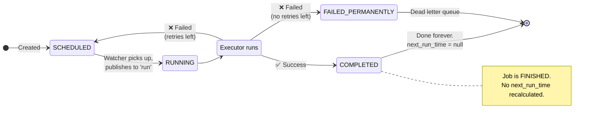
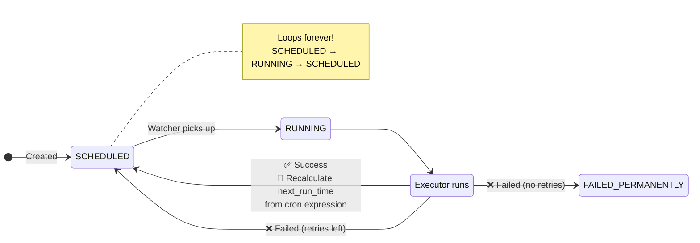
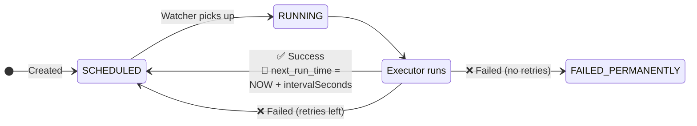

Great question — there are **two levels of status** in your system, and they behave differently per schedule type. Let me trace through each one:

## Two Status Levels

| Level | Table | Enum | Meaning |
|-------|-------|------|---------|
| **Job** (the definition) | `jobs` | `JobStatus` | Is this job *active* in the system? |
| **JobRun** (each execution) | `job_runs` | `JobRunStatus` | How did *this specific run* go? |

---

## ONCE (One-Time Job)

The job runs **exactly once** and is done forever.



| Step | Job Status | next_run_time | JobRun Status |
|------|-----------|---------------|---------------|
| Created | `SCHEDULED` | User-specified time (or now) | — |
| Watcher polls it | `SCHEDULED` | unchanged | — |
| Published to Kafka `run` | `RUNNING` | unchanged | `PENDING` |
| Executor starts | `RUNNING` | unchanged | `RUNNING` |
| **Success** | **`COMPLETED`** | **`null`** — done forever | `SUCCESS` |
| **Failure (retries left)** | `SCHEDULED` | recalculated with backoff | `FAILED` (this run) |
| **Failure (no retries)** | `FAILED_PERMANENTLY` | `null` | `FAILED` |

> **Key**: After success, `next_run_time` becomes `null`. The watcher will **never** pick it up again.

---

## CRON (Recurring on Schedule)

The job runs **forever** on a cron schedule. It **never** reaches `COMPLETED`.



| Step | Job Status | next_run_time | JobRun Status |
|------|-----------|---------------|---------------|
| Created | `SCHEDULED` | Next cron match (e.g., tomorrow midnight) | — |
| Watcher polls it | `SCHEDULED` → `RUNNING` | unchanged | `PENDING` |
| Executor starts | `RUNNING` | unchanged | `RUNNING` |
| **Success** | **`SCHEDULED`** ← back! | **Recalculated** from cron (next occurrence) | `SUCCESS` |
| **Failure (retries left)** | `SCHEDULED` | Backoff delay | `FAILED` |
| **Failure (no retries)** | `FAILED_PERMANENTLY` | `null` | `FAILED` |

> **Key**: On success, the status goes **back to `SCHEDULED`** (not `COMPLETED`!) and `next_run_time` is recalculated to the next cron occurrence. The cycle repeats indefinitely.

**Example**: Cron `0 0 * * *` (daily midnight)
```
next_run_time = Sep 9 00:00 → runs → success → next_run_time = Sep 10 00:00
                Sep 10 00:00 → runs → success → next_run_time = Sep 11 00:00
                ... forever
```

---

## INTERVAL (Recurring at Fixed Interval)

Same as CRON but simpler — runs every N seconds from the **last execution**.



| Step | Job Status | next_run_time | JobRun Status |
|------|-----------|---------------|---------------|
| Created | `SCHEDULED` | `now + intervalSeconds` | — |
| Watcher polls it | `SCHEDULED` → `RUNNING` | unchanged | `PENDING` |
| **Success** | **`SCHEDULED`** ← back! | **`NOW() + intervalSeconds`** | `SUCCESS` |
| **Failure (retries left)** | `SCHEDULED` | Backoff delay | `FAILED` |
| **Failure (no retries)** | `FAILED_PERMANENTLY` | `null` | `FAILED` |

> **Key difference from CRON**: CRON calculates the next occurrence from the cron expression (wall-clock aligned), while INTERVAL just adds N seconds from the current time (drift-friendly).

---

## The Unified Rule

```
After execution:
├── ONCE    + success  →  status = COMPLETED,          next_run_time = null
├── CRON    + success  →  status = SCHEDULED (loop),    next_run_time = cron.next()
├── INTERVAL+ success  →  status = SCHEDULED (loop),    next_run_time = now + interval
└── ANY     + failure  →  retry or FAILED_PERMANENTLY,  next_run_time = null
```

The **watcher doesn't need to know the schedule type** when polling. It just asks: *"Is `next_run_time ≤ NOW()`?"*. The recalculation of the next run happens **after execution** — that's where the schedule type matters, and it will be the responsibility of the executor/consumer that processes the completed run event.

Viewed application.properties:1-2